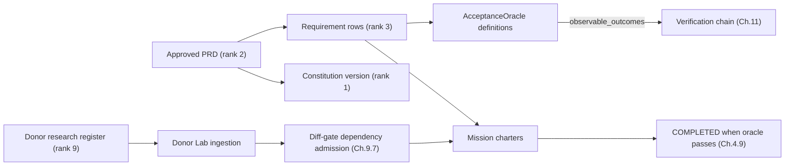

# Product document template — contract-grounded

> **Work record, not Project Truth.** This template is an authoring instrument. It produces
> rank-0..3 artifacts (constitution version, requirements, EDR inputs) but is itself none of
> them; nothing here modifies Project Truth except through the change-control path of
> blueprint Ch.2.4, and only `engine/truth/**` ever writes Truth tables.

- **version:** 1.2
- **authority:** `docs/blueprint/REV_2_0.md` (Ch.2 authority ranks, Ch.2.4 Project Truth,
  Ch.11 verification, Ch.13.8 donor governance) + `schemas/objects/*.json` as schema truth
- **consumers:** DDE-065 generation-prompt compiler (fail-closed on unresolved inputs),
  mission chartering (Ch.4), Donor Lab ingestion (DDE-046/047), diff-gate admission (Ch.9.7)
- **companion example:** [product-document-example-ledgerline.md](product-document-example-ledgerline.md)
- **document_scope:** `full_product | feature_slice` — declare which this document is before
  writing anything else. If `feature_slice`, name the Product Constitution it rolls up under
  (even one that doesn't exist yet — "not yet authored; this may become its first slice" is a
  valid answer). A document that silently mixes both scopes is the most common source of
  reviewer disagreement; don't leave it implicit.

## How to use this template

Fill every section in order. Sections 1–5 are Truth-shaped: their structured blocks are meant
to be promoted verbatim into durable rows (constitution version, requirements, oracles) once
approved — so field names and enum values below are copied from the schemas, not invented.
Anything this template cannot express as a Truth-shaped slot stays rank-10 commentary and may
inform but never modify a requirement.

All `<uuid>` placeholders below (Section 4) are application-generated **UUIDv7** per
Ch.3.4, same as every other identity in the system — not UUIDv4, not hand-typed.



**The one rule that makes the anti-generic machinery work:** every quality claim in this
document ("polished", "professional", "modern") must survive translation into Section 4 as an
`observable_outcome` with at least one evidence binding. Ch.11.2: *"A prose statement with no
binding is not an acceptance criterion."* A claim you cannot bind is a wish, and wishes are
rank-10.

---

## 1. Rank-0 anchors — Product Constitution draft

Promotes to a `ProductConstitutionVersion` row (`schemas/objects/product_constitution_version.json`;
fields `version`, `status ∈ {draft, active, superseded}`, `body_markdown`, `content_hash`,
`supersedes_id`). Write it as the future `body_markdown`. Changes only through change control
(Ch.2.4); supersede, never rewrite.

- **purpose:** one paragraph. What exists, for whom, and what would break if it disappeared.
- **target users:** named roles with their frequency of use and primary surface.
- **non-negotiable constraints:** MUST/ MUST NOT statements that outrank any feature request.
  Each becomes permanent review ammunition; do not list anything you are not willing to block
  a release over.
- **core workflows:** the 3–7 flows that define the product; everything else is elaboration.
- **UX principles:** see Section 3 law block — these anchors must be compatible with the token
  sheet and the states-completeness law, not vibes.
- **security principles:** authentication model, tenancy boundary, secret handling posture
  (Ch.14 vocabulary: principals, grants, credential handles).
- **explicit exclusions:** what this product deliberately does not do. An exclusion nobody
  wrote down will be "discovered" as a requirement mid-mission.
- **cross-cutting constraints register:** one row per constraint that will recur across
  requirements or feature briefs (tenancy isolation, audit trail, idempotency posture,
  authentication model, and similar). Give each a short `id`; Sections 2 and 3 reference the
  `id` instead of restating the constraint in their own words. This is the single source of
  truth for wording that would otherwise drift across sections — if the two copies of a
  tenancy statement in §2 and §3 ever disagree, this register is what's authoritative.

  ```yaml
  - id: CC-001
    statement: >-
      ...                         # e.g. "row-level tenant isolation enforced at the DB layer"
    applies_to: [requirements, feature_briefs]   # where this gets referenced from
  ```

  References use the bracketed-prefix serialization defined in Section 2 (`[CC-001] ...`)
  because both consuming arrays are string-typed in `requirement.json`; the id registry
  itself lives here.

## 2. Requirements ledger

One entry per stable, testable behaviour (Ch.2.4 definition). Slugs follow the §3.4 grammar —
project-prefixed, e.g. `REQ-LL-014`; they become the immutable `slug` column and are how
missions, oracles, EDRs and evidence reference truth (`requirement_refs[]`,
`affected_requirement_slugs[]`). Status lifecycle is exactly `draft → approved → retired |
superseded` with `supersedes_id` on supersession; never rewrite an approved statement.

**Serialization law for this ledger.** `requirement.json` types both arrays as strings only
(`"items": { "type": "string" }`). The structured forms below are **authoring sugar**: ids are
stable authoring identifiers held in this document, and at promotion time every item serializes
to a single string with the id as a bracketed prefix — `"[CC-001] <statement>"`,
`"[AC-LL-014-1] <statement>"`. Never widen the contract to carry the objects; that is an EDR,
not an edit.

```yaml
- slug: REQ-XXX-NNN            # immutable, project-prefixed, zero-padded
  statement: >-                # single testable behaviour; no AND-chains
    ...
  constraints:                 # non-functional bounds: perf, security, compliance, platform
    - "..."                    # constraint-specific to this requirement (plain string)
    - "[CC-001] <restate only what this requirement adds beyond CC-001>"
                                # or reference a §1 cross-cutting constraint by id-prefix
  acceptance_conditions:       # observable conditions; each seeds an oracle outcome in §4
    - "[AC-XXX-NNN-1] <observable condition statement>"
                                # condition_id lives in the bracket prefix; §4 outcomes cite it
  status: draft                # draft | approved | retired | superseded
  supersedes_id: null          # set only when superseding an approved requirement
```

Ledger hygiene rules:

- Every `acceptance_conditions` item must be phrased so Section 4 can bind it to a producer.
  If you cannot imagine the producer, the condition is not yet a requirement.
- Every acceptance condition carries a stable bracketed id (`[AC-<slug>-<n>] ...`). Section 4
  outcomes cite this id in their statement text — the translation from "what must be true" to
  "what proves it" must be a traceable link, not something a reviewer eyeball-matches by
  reading both sections.
- Constraints are where the ERP-grade hardness lives: row-level tenancy, audit trails,
  idempotent mutations (`command_id` + `idempotency_key` on every externally visible mutation,
  Ch.12.5), RLS expectations per Ch.3.2. If the constraint is shared with other requirements or
  feature briefs, put it in the §1 cross-cutting register once and reference it — don't
  re-author the same rule in slightly different words each time it applies.
- Split compound statements. A requirement with two verbs gets decomposed now, not mid-mission
  (a mission failing its oracle yields `WRONG_PRODUCT`, which is a decomposition-quality
  signal, Ch.11.3).

## 3. Feature briefs

One brief per cross-cutting feature. The body mirrors Feature DNA's canonical shape
(Ch.2.4 glossary: *"purpose, actors, requirements, workflow, states, business rules,
algorithms, data model, APIs, UI structure, permissions, events, donor sources, EDR
dependencies, security requirements, acceptance tests"*). In DDE's own products this arrives
as a `FeatureDNA` row extracted from donor material; in a product document it is authored
up front and donor sources attach later through Section 5.

```yaml
- title: ...
  purpose: ...
  actors: [...]                  # roles from §1 target users, not abstractions
  workflow:                      # happy path as ordered steps; error paths go in states
    - step: ...
      actor: ...
  states:                        # every state a user can perceive, incl. failure states
    - ...
  business_rules:
    - "..."
  data_model_sketch: ...         # entities, key relations, tenancy columns
  api_surface_sketch: ...        # resources + verbs; mutations declare idempotency intent
  ui_structure:
    surfaces:
      - name: ...
        layout_pattern: ...      # declared pattern; see law block below
        states: [idle, loading, empty, error, disabled]   # completeness law
    art_direction: ...           # references the token sheet; never raw literals
    motion_spec: ...             # durations/easings via motion tokens only
  permissions:
    - role: ...
      can: [...]
  events:                        # domain events emitted; audit-relevant ones flagged
    - name: ...
      side_effect_class: ...     # PURE_READ | WORKSPACE_LOCAL | EXTERNAL_IDEMPOTENT |
                                  # EXTERNAL_NON_IDEMPOTENT | IRREVERSIBLE (Ch.9.3) — tag every
                                  # mutating event/verb now so §7's prediction is a rollup of
                                  # these tags, not a fresh guess written from scratch.
                                  # Authoring intent only: Ch.9.3 classes legally attach to
                                  # capability descriptors; the tag migrates onto the admitting
                                  # capability at admission time (Ch.9).
      audit_relevant: true
  security_requirements:
    - "..."                      # authn/authz, injection surface, credential exposure
    - "[CC-001] ..."             # or reference a §1 cross-cutting constraint by id-prefix
  requirement_refs: [REQ-XXX-NNN]
```

**UI law block (binds every `ui_structure` in this document):**

- **Token discipline (CI-enforced):** every colour, spacing, radius, shadow, type size,
  duration, easing and z-index comes from the design-token sheet; freehand literal style
  input is refused by law (conformance-by-construction, Ch.13.8). Art direction names token
  families and relationships ("surface hierarchy in three steps"), never hex codes.
- **Pattern lock:** name the declared layout pattern for each surface. If no existing pattern
  fits, stop and raise an EDR — an improvised grammar is how generic-looking output happens.
- **Anti-tell catalog applies from day one:** no gradients-as-primary device, no default
  purple/indigo, no emoji icons, no pill-spam badges, no identical repeated card grids, no
  glassmorphism, no decorative charts without real data, no marketing-hero grammar in
  operator surfaces. These are tells of generated output; the product must not ship them.
- **States completeness:** idle/loading/empty/error/disabled declared for every interactive
  surface; empty states carry one-line factual titles, not helper essays.
- **Copy voice:** verb-first controls, sentence case, figures over words, no exclamation
  marks, no "simply/easily/just", errors state cause + next action. Domain vocabulary comes
  from the schemas (mission/run/lease/gate terms), never marketing synonyms.
- **Motion restraint:** tokens only, reduced-motion variant per animated rule, loops bounded,
  springs/bounce banned.
- **Provenance:** anything mined from an external repo or AI-generator output needs a licence
  check before deep reading and a provenance-ledger row before merge (repo-mining skill;
  Ch.13.8 classifies the source first).

## 4. Acceptance oracles

Translates Sections 2–3 into executable acceptance definitions bound to real producers
(`acceptance_oracle.json`). Two scopes exist: `scope: task` proves a task was done;
`scope: mission` proves the right product was built — the latter feeds the `WRONG_PRODUCT`
check (Ch.11.3) and must exist for every mission this document charters. Oracle-first applies:
define these before implementation starts, and before any `risk_class ≥ high` task executes.

```yaml
- scope: mission                # task | mission
  oracle_version: <content-hash-over-definition-fields>
  requirement_refs: [REQ-XXX-NNN]
  feature_refs: [...]
  minimum_confidence: 0.9       # mid-band results stay inconclusive (Ch.11)
  human_assertions:             # things only a person can assert; feed approval flow
    - "..."
  domain_invariants:
    - "..."                     # e.g. "sum(line_totals) == invoice.total always"
  observable_outcomes:
    - outcome_id: <uuid>                     # UUIDv7
      statement: >-
        [proves AC-XXX-NNN-1] ...            # the §2 condition this outcome proves, cited in
                                             # statement text (ObservableOutcome has
                                             # additionalProperties:false — no extra ref keys).
                                             # Every AC resolves to exactly one POSITIVE outcome;
                                             # negative cases may additionally cite an AC as
                                             # supplementary proof.
      evidence_binding:
        kind: visual_diff       # one of the nine kinds below
        ref: <suite/case id>
        command: [...]          # when runnable
        independence: <who produced it, if not the generator>
  negative_cases:               # same shape; the abuse cases, not the happy path
    - outcome_id: <uuid>                     # UUIDv7
      statement: >-
        attempting X without permission Y fails closed; also evidences [AC-XXX-NNN-1]
      evidence_binding:
        kind: api_probe
        ref: <probe id>
```

Binding kinds, verbatim from the schema (superset of the eight Ch.11.2 names):
`test`, `db_assertion`, `api_probe`, `visual_diff`, `security_scan`, `android_scan`,
`invariant`, `judge`, `human`.

**Definition-of-Polished battery** (Ch.11 amendment) — for every user-facing surface, the
oracle set must include outcomes covering:

- design lints clean (DD201–DD207 classes);
- silhouette-distinct against a generic-layout corpus (the anti-template test);
- believable information density (realistic sample data, judged from rendered pixels);
- VLM rubric ≥ threshold **or** explicit human pixel sign-off recorded through the approvals
  surface (`prototype_pixel_signoff`);
- copy honesty tests green;
- per-interaction motion spec present, including its reduced-motion degradation.

A UI claim bound only to prose fails the oracle validator by construction. If your best
available producer for a claim is `judge` or `human`, say so explicitly — that is honest and
routes correctly into the approval flow; hiding it as a "test" is not.

**Coverage check:** every `acceptance_conditions` item from Section 2 must be cited by its
bracketed id in exactly one positive outcome here; negative cases may cite an AC
additionally. An acceptance condition with no matching citation is unfinished translation,
not a small gap — go back and bind it before moving on.

## 5. Donor research register

This section is the research mandate: before building any significant capability, search for
existing tools, repos, registries, component sets and animation libraries that already solve
it, and record them here. The register is rank-9 intake — it informs requirements and missions
but never modifies them (§2.2 precedence rule), and nothing donor-derived enters
implementation until classified and admitted (Ch.13.8).

One row per candidate, using the six-value reuse taxonomy assigned **before** any
implementation use:

| field | allowed values / notes |
|---|---|
| `source_uri` | exact location |
| `source_class` | `OPEN_REUSE` · `CONDITIONAL_REUSE` · `SOURCE_REFERENCE_ONLY` · `RESTRICTED` · `UNKNOWN` · `REJECTED` |
| `media_kind` | `registry_json` · `readme` · `licence_text` · `source_tree` · `other` |
| licence | SPDX id or "unverified"; unlicensed/unknown defaults DOWN, never up |
| maintenance_signal | `ok` · `warn` · `unknown` · `critical` |
| `checked_at` | date this row's licence/maintenance signal was last verified; a stale `ok` is not a current `ok` — recheck rather than carry it forward silently |
| intended_use | what slot in Sections 2–4 it would serve |

Classification guidance for the sources this register will actually attract:

- shadcn-ecosystem registries and blocks: `OPEN_REUSE` (programmatically ingestable);
- commercial template products (Tailwind Plus, Cruip-class): `CONDITIONAL_REUSE` — usable as
  art direction, never as generator input;
- marketplace bundles: `REJECTED` for builder use;
- showcase galleries (godly.site, lapa.ninja, mobbin-class): `SOURCE_REFERENCE_ONLY`;
- animation/motion-component libraries enter through the same classification at the same gate.

When a candidate ships as a package dependency rather than reference material, it also needs
a Ch.9.6 admission record: new top-level packages require the AGENTS.md justification triple —
licence, maintenance signal, and why the standard library is insufficient — recorded on the
admission row; missing justification is REJECTED (fail closed). Predict those admissions now
in Section 6's approvals.

Register discipline: classify from licence text, not vibes; `UNKNOWN` is a legitimate state
but blocks use; prompt-injection findings inside donor content have authority rank 10 and can
never elevate themselves (Ch.14).

## 6. Mission decomposition sketch

How Sections 2–4 become chartered work. This sketch instantiates the `MissionTemplate`
shape (`mission_template.json`: nodes with `task_class`, 1–5 observable `success_criteria`,
`estimated_effort xs|s|m`, `blast_radius`, `risk_class`, write/read scopes; edges with five
edge types). It is a planning aid — the durable registry object is content-hashed and created
through the planner path, not by this document.

```yaml
template_key: product-slug--feature-slice
description: ...
nodes:
  - node_key: specification
    task_class: specification     # discovery | specification | decision | enabling |
    intent: ...                   # implementation | integration | verification | repair |
    success_criteria:             # documentation — max 5, phrased observably; each should
                                   # cite a §4 oracle outcome_id where one exists
      - "..."
    estimated_effort: s           # xs | s | m  ('l' means: decompose further instead)
    blast_radius: local           # local | module | cross_module | systemic
    risk_class: medium            # low | medium | high | critical
    expected_write_scope: [...]   # paths/tables; leases bind to this (Ch.12)
    expected_read_scope: [...]
edges:
  - from_node_key: specification
    to_node_key: schema
    edge_type: depends_on         # depends_on | produces_contract_for | verifies |
                                  # repairs | blocks_on_decision
```

Sketch laws:

- Graph shape follows the golden-mission pattern (§19.2): specification → schema → service →
  API → UI → tests → verification. Verification nodes verify, they never implement. If this
  slice's graph deviates from that shape (a pure-migration slice with no UI node, a mobile
  target adding DDE-069-class nodes, etc.), say so explicitly here rather than leaving a
  silently different shape for a reviewer to notice on their own.
- Use `blocks_on_decision` wherever a governance answer is needed (donor classification,
  dependency admission, oracle approval) so the graph blocks honestly instead of guessing.
- Any node whose `success_criteria` cannot cite a Section 4 oracle outcome has not finished
  being specified.
- Effort `m` is the ceiling; if a node feels like an `l`, it is two nodes.

## 7. Autonomy ceiling and predicted approvals

Per mission slice: the autonomy ceiling is chosen once, by a human, and can never be raised
by a worker, plan or route (Ch.13.5). Levels run 0 propose-only → 6 IRREVERSIBLE.

```yaml
autonomy_ceiling: 2             # 0..6; start low for side-effecting slices
predicted_approvals:            # approval_type enum from Ch.13; each binds via scope_hash
  - approval_type: donor_reuse          # any Section 5 row entering implementation
  - approval_type: dependency_addition  # each new top-level package (with justification)
  - approval_type: oracle_approval      # mission-oracle policy sign-off
  # full enum: architecture_change · production_change · scope_widening ·
  # capability_grant · oracle_approval · irreversible_effect ·
  # dependency_addition · donor_reuse · budget_increase
side_effect_classes_expected:   # capabilities this slice will exercise (Ch.9.3 taxonomy) —
                                 # this should be a rollup of the side_effect_class tags
                                 # already attached to §3 events, not a fresh judgment call
  - EXTERNAL_IDEMPOTENT         # PURE_READ · WORKSPACE_LOCAL · EXTERNAL_IDEMPOTENT ·
                                # EXTERNAL_NON_IDEMPOTENT · IRREVERSIBLE
```

Predicting approvals here is what keeps missions unblocked later: an unpredicted
`donor_reuse` approval discovered mid-mission stalls the graph on a `blocks_on_decision`
edge that someone forgot to draw.

---

## Open decisions / EDR intake

Structured, not prose — this is rank-9/10 intake and should be as traceable as everything
else in this document. Add a row whenever something in Sections 1–7 can't be resolved by
this document alone. Keys mirror `schemas/objects/edr.json` (`context`, `alternatives`,
`affected_requirement_slugs`) so each row maps 1:1 onto a `TruthService.propose_edr`
pre-image; the authoring-only fields carry placement and ownership.

```yaml
- context: ...                 # the question that needs a governed answer (edr.json field)
  alternatives:                # edr.json field; include "do nothing" where honest
    - ...
  affected_requirement_slugs: [REQ-XXX-NNN]   # edr.json field; [] if pre-requirement
  blocks:                      # authoring: section/node/row currently blocked
    - ...
  proposed_default: ...        # what happens if nobody answers before build starts, or
                               # "none — this must block" if there is no safe default
  owner: ...                   # who is expected to raise or answer the EDR
```

Typical triggers: product-specific layout patterns beyond the declared set; any donor row
whose classification conflicts with the guidance in Section 5; any oracle claim whose best
producer is contested; any §6 node that deviates from the golden-mission shape without a
settled reason.

## Completeness self-check

Run this before treating the document as ready for review or for the DDE-065 compiler, which
fails closed on unresolved inputs — better to surface a gap here than have the compiler
surface it later.

- [ ] Every `acceptance_conditions` item in Section 2 is cited by its bracketed id in exactly
      one positive Section 4 outcome (negative-case citations are additional, not substitutes).
- [ ] Every `observable_outcome` and negative case has a real `evidence_binding`; none are
      prose-only.
- [ ] Every requirement has at least one negative case somewhere in Section 4.
- [ ] Every Section 6 node's `success_criteria` cites a Section 4 oracle outcome where one
      exists.
- [ ] Every Section 5 row has a classification and a `checked_at` date; nothing defaulted
      upward from `UNKNOWN`.
- [ ] Section 7's `side_effect_classes_expected` matches the union of `side_effect_class` tags
      used in Section 3.
- [ ] Section 7's `predicted_approvals` covers every Section 5 row headed for implementation
      and every new dependency implied by Sections 3/6.
- [ ] No adjective in Sections 1 or 3 ("polished", "modern", "intuitive", etc.) is left
      unbound — each resolves in Section 4 or is logged in Open decisions / EDR intake.
- [ ] `document_scope` at the top is set and, if `feature_slice`, names the constitution it
      rolls up under.
- [ ] Any unchecked box above is disclosed in Open decisions / EDR intake rather than left
      silent.

---

## Traceability

| Template section | Contract / chapter |
|---|---|
| 1 Rank-0 anchors | `product_constitution_version.json`; Ch.2.2 ranks; Ch.2.4 |
| 2 Requirements ledger | `requirement.json`; slug grammar §3.4; status lifecycle Ch.2.4 |
| 3 Feature briefs | Feature DNA shape (Ch.2.4, Ch.13.8); playbook/skills UI law; Ch.9.3 side-effect taxonomy |
| 4 Acceptance oracles | `acceptance_oracle.json`; binding rule Ch.11.2; WRONG_PRODUCT Ch.11.3; DoP battery Ch.11 amendment |
| 5 Donor register | `donor_artifact.json`; six-value taxonomy Ch.13.8; admission Ch.9.6/9.7 |
| 6 Mission decomposition | `mission_template.json`; golden-mission graph §19.2 |
| 7 Autonomy & approvals | `mission.json`; approval enum + ceiling Ch.13.5; side_effect_class Ch.9.3 |
| Open decisions / EDR intake | `edr.json` pre-images (rank-9/10 intake); change-control path Ch.2.4 |
